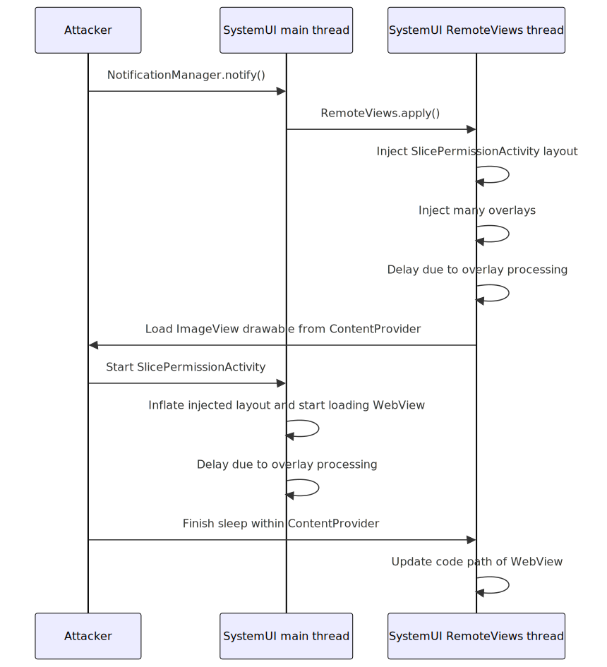

Fix for this issue has appeared as CVE-2025-22441: [bulletin](https://source.android.com/docs/security/bulletin/2025-08-01#framework) [patch](https://android.googlesource.com/platform/frameworks/base/+/60335b2eae7311fe6e10e140b64489008a38a5a8%5E%21/) [follow up](https://android.googlesource.com/platform/frameworks/base/+/37bf5823504f2a256f128123393cd149721b87fc%5E%21/#F0)

# Passing `ApplicationInfo` around

[`ApplicationInfo`](https://developer.android.com/reference/android/content/pm/ApplicationInfo) is structure defining various information about installed app, most notably path to apk file from which resources and code are loaded

Usually it is passed from system to applications, however sometimes there are cases where non-system caller could provide own one. For example in the past that was [vulnerability in `bindBackupAgent()` method, where attacker could pass in parameter own `ApplicationInfo` object with `uid` and `sourceDir` values and they weren't checked against what apps are really installed in system](https://seclists.org/fulldisclosure/2015/Apr/52), because that method was meant to be called internally by `system_server`, but was exposed to `adb shell`

This time though, I've looked closely at [`ApplicationInfo` field within `RemoteViews`](https://cs.android.com/android/platform/superproject/main/+/main:frameworks/base/core/java/android/widget/RemoteViews.java;l=356;drc=978f80da915fe0a64d0b6425ce30d5359563b5e9)

`RemoteViews` is object describing view that can come from another process. This most notably is [used for home screen widgets](https://developer.android.com/guide/topics/appwidgets#handle-events), where app providing widget builds `RemoteViews` and then it is ["applied"](https://developer.android.com/reference/android/widget/RemoteViews#apply(android.content.Context,%20android.view.ViewGroup)) within home screen process

Other places where `RemoteViews` are used are [notifications](https://developer.android.com/reference/android/app/Notification.Builder#setCustomBigContentView(android.widget.RemoteViews)) (applied by SystemUI process) and [autofill dialogs](https://developer.android.com/reference/android/service/autofill/Presentations.Builder#setDialogPresentation(android.widget.RemoteViews)) (provided by autofill service, applied by `system_server`)

`RemoteViews.mApplication` field is serialized through `Parcel` and therefore may come from remote processes and whenever `RemoteViews` are applied it is used by following method [(snippet source)](https://cs.android.com/android/platform/superproject/main/+/main:frameworks/base/core/java/android/widget/RemoteViews.java;l=6545-6561;drc=978f80da915fe0a64d0b6425ce30d5359563b5e9):

```java
private Context getContextForResourcesEnsuringCorrectCachedApkPaths(Context context) {
    if (mApplication != null) {
        if (context.getUserId() == UserHandle.getUserId(mApplication.uid)
                && context.getPackageName().equals(mApplication.packageName)) {
            return context;
        }
        try {
            LoadedApk.checkAndUpdateApkPaths(mApplication);
            return context.createApplicationContext(mApplication,
                    Context.CONTEXT_RESTRICTED);
        } catch (NameNotFoundException e) {
            Log.e(LOG_TAG, "Package name " + mApplication.packageName + " not found");
        }
    }

    return context;
}
```

Most interesting here is `LoadedApk.checkAndUpdateApkPaths()` call, as this is static method and will modify some global state [(snippet source)](https://cs.android.com/android/platform/superproject/main/+/main:frameworks/base/core/java/android/app/LoadedApk.java;l=2275-2302;drc=5916ee589c4880e2d8a1a9ad6dc852108e4c44c1)

```java
public static void checkAndUpdateApkPaths(ApplicationInfo expectedAppInfo) {
    // Get the LoadedApk from the cache
    ActivityThread activityThread = ActivityThread.currentActivityThread();
    if (activityThread == null) {
        Log.e(TAG, "Cannot find activity thread");
        return;
    }
    checkAndUpdateApkPaths(activityThread, expectedAppInfo, /* cacheWithCode */ true);
    checkAndUpdateApkPaths(activityThread, expectedAppInfo, /* cacheWithCode */ false);
}

private static void checkAndUpdateApkPaths(ActivityThread activityThread,
        ApplicationInfo expectedAppInfo, boolean cacheWithCode) {
    String expectedCodePath = expectedAppInfo.getCodePath();
    LoadedApk loadedApk = activityThread.peekPackageInfo(
            expectedAppInfo.packageName, /* includeCode= */ cacheWithCode);
    // If there is load apk cached, or if the cache is valid, don't do anything.
    if (loadedApk == null || loadedApk.getApplicationInfo() == null
            || loadedApk.getApplicationInfo().getCodePath().equals(expectedCodePath)) {
        return;
    }
    // Duplicate framework logic
    List<String> oldPaths = new ArrayList<>();
    LoadedApk.makePaths(activityThread, expectedAppInfo, oldPaths);

    // Force update the LoadedApk instance, which should update the reference in the cache
    loadedApk.updateApplicationInfo(expectedAppInfo, oldPaths);
}
```

Lets discuss what is going on in these methods

First we're calling 3-parameter `checkAndUpdateApkPaths` with `cacheWithCode` being set to both `true` and `false`. The `LoadedApk` object can be constructed in two modes, either with [`mIncludeCode`](https://cs.android.com/android/platform/superproject/main/+/main:frameworks/base/core/java/android/app/LoadedApk.java;l=134;drc=5916ee589c4880e2d8a1a9ad6dc852108e4c44c1) being `true` or `false`, which SDK-wise maps to `Context` with [`CONTEXT_INCLUDE_CODE` flag](https://developer.android.com/reference/android/content/Context#CONTEXT_INCLUDE_CODE) being set or not

That method will first use `ActivityThread.peekPackageInfo()`, which will return already cached `LoadedApk` instance, therefore if app didn't previously construct `LoadedApk` with matching `packageName` and `includeCode`, `peekPackageInfo()` will return `null` and `checkAndUpdateApkPaths()` won't do anything

Looking back at `RemoteViews.getContextForResourcesEnsuringCorrectCachedApkPaths()`, we have `context.createApplicationContext(mApplication, Context.CONTEXT_RESTRICTED)` there, the `CONTEXT_INCLUDE_CODE` flag was not specified (same is the case with contexts passed in argument to that method) and therefore that method will always using `LoadedApk` with `mIncludeCode=false`

Therefore, for `RemoteViews` updating version with code is unnecessary, as `RemoteViews` are always using `Context` without code. [Commit message just says that there are two places where `ApplicationInfo` may be cached](https://android.googlesource.com/platform/frameworks/base/+/acfcc90ebd40be13b5058529d2b77dd57cbe2c8f%5E%21/) and I think removing updating version with code wouldn't cause issues here (as [`checkAndUpdateApkPaths()` is only used by `AppWidgetHostView` and `RemoteViews`](https://cs.android.com/android/platform/superproject/main/+/main:frameworks/base/core/java/android/app/LoadedApk.java;drc=5916ee589c4880e2d8a1a9ad6dc852108e4c44c1;bpv=1;bpt=1;l=2275?gsn=checkAndUpdateApkPaths&gs=KYTHE%3A%2F%2Fkythe%3A%2F%2Fandroid.googlesource.com%2Fplatform%2Fsuperproject%2Fmain%2F%2Fmain%3Flang%3Djava%3Fpath%3Dandroid.app.LoadedApk%2321c7f13aaa7e4ee09225e6559d89df1c481e19b41c55405385112b92363f53c9)). Counterargument to that though is avoiding possibility of getting various caches out of sync and that in itself while removing call with `cacheWithCode=true` removes most severe impact of this bug, it doesn't completely fix issue as modification of just resources (instead of code) still might be valuable to attacker

# `LoadedApk.updateApplicationInfo()`

So far presented code is only used for `RemoteViews` (widgets, notifications, etc), but now we'll be entering `LoadedApk.updateApplicationInfo()` which is also used for updating running app processes after [new split has been installed](https://developer.android.com/reference/android/content/pm/PackageInstaller.SessionParams#MODE_INHERIT_EXISTING) (for example when using [Play Feature Delivery](https://developer.android.com/guide/playcore/feature-delivery) on-demand delivery)

Now untrusted `ApplicationInfo` object from `RemoteViews` will be passed to `updateApplicationInfo()`, lets take a look what that method does [(snippet source)](https://cs.android.com/android/platform/superproject/main/+/main:frameworks/base/core/java/android/app/LoadedApk.java;l=343-347;drc=5916ee589c4880e2d8a1a9ad6dc852108e4c44c1)

```java
public void updateApplicationInfo(@NonNull ApplicationInfo aInfo,
        @Nullable List<String> oldPaths) {
    if (!setApplicationInfo(aInfo)) {
        return;
    }
```

Let's take a look at that `setApplicationInfo()` [(snippet source)](https://cs.android.com/android/platform/superproject/main/+/main:frameworks/base/core/java/android/app/LoadedApk.java;l=392-422;drc=5916ee589c4880e2d8a1a9ad6dc852108e4c44c1)

```java
private boolean setApplicationInfo(ApplicationInfo aInfo) {
    if (mApplicationInfo != null && mApplicationInfo.createTimestamp > aInfo.createTimestamp) {
        Slog.w(TAG, "New application info for package " + aInfo.packageName
                + " is out of date with TS " + aInfo.createTimestamp + " < the current TS "
                + mApplicationInfo.createTimestamp);
        return false;
    }
    // Snip: assign fields such as mAppDir and mResDir on this object from aInfo
    return true;
}
```

[`createTimestamp` field is normally set to `SystemClock.uptimeMillis()`](https://cs.android.com/android/platform/superproject/main/+/main:frameworks/base/core/java/android/content/pm/ApplicationInfo.java;l=1943;drc=5916ee589c4880e2d8a1a9ad6dc852108e4c44c1), but as this object is coming from attacker, this means that attacker can provide future value to prevent further `updateApplicationInfo()` calls from executing

Returning to `updateApplicationInfo()` [(snippet source)](https://cs.android.com/android/platform/superproject/main/+/main:frameworks/base/core/java/android/app/LoadedApk.java;l=349-372;drc=5916ee589c4880e2d8a1a9ad6dc852108e4c44c1)

```java
final List<String> newPaths = new ArrayList<>();
makePaths(mActivityThread, aInfo, newPaths);
final List<String> addedPaths = new ArrayList<>(newPaths.size());

// Snip: populate addedPaths with items that are in newPaths and not in oldPaths (passed in argument)
synchronized (mLock) {
    createOrUpdateClassLoaderLocked(addedPaths);
```

List of `addedPaths` is built: in case of installation of new split `oldPaths` would contain list of paths that were used before installation of new split and `addedPaths` would contain list of `.apk` files that have to be added to existing `ClassLoader`, however in case of `checkAndUpdateApkPaths()` `oldPaths` will be built from exactly same `ApplicationInfo` object and therefore `addedPaths` will be empty and attacker won't be able to add new paths to existing `ClassLoader` here

`createOrUpdateClassLoaderLocked()` is long method, but only few things are interesting here:

* [If `mIncludeCode` is `false`, only thing done is creating `ClassLoader` without referencing any `apk`/`dex` files](https://cs.android.com/android/platform/superproject/main/+/main:frameworks/base/core/java/android/app/LoadedApk.java;l=968-990;drc=5916ee589c4880e2d8a1a9ad6dc852108e4c44c1)
* Most dangerous thing is creating new `ClassLoader` using paths that were just set using attacker-controlled `ApplicationInfo`, however that only will happen if [`mDefaultClassLoader` is `null`](https://cs.android.com/android/platform/superproject/main/+/main:frameworks/base/core/java/android/app/LoadedApk.java;l=1005;drc=5916ee589c4880e2d8a1a9ad6dc852108e4c44c1), which means that this is first `createOrUpdateClassLoaderLocked()` on that `LoadedApk` instance (`mDefaultClassLoader` field refers to instance of `ClassLoader` used before applying [`AppComponentFactory.instantiateClassLoader()`](https://developer.android.com/reference/android/app/AppComponentFactory#instantiateClassLoader(java.lang.ClassLoader,%20android.content.pm.ApplicationInfo)))
* There is also [adding new paths to native library search path of that `ClassLoader`](https://cs.android.com/android/platform/superproject/main/+/main:frameworks/base/core/java/android/app/LoadedApk.java;l=1050-1058;drc=5916ee589c4880e2d8a1a9ad6dc852108e4c44c1), however to exploit that victim app would need to perform `System.loadLibrary()` that normally isn't present
* And there is [adding `apk`/`dex` paths from `addedPaths` argument to existing `ClassLoader`](https://cs.android.com/android/platform/superproject/main/+/main:frameworks/base/core/java/android/app/LoadedApk.java;l=1060-1065;drc=5916ee589c4880e2d8a1a9ad6dc852108e4c44c1), however on code path from `RemoteViews` `addedPaths` will be empty

Returning to `updateApplicationInfo()` again, there's still one relevant thing that this method does, [replacing `LoadedApk.mResources` with instance that uses new `mResDir` value](https://cs.android.com/android/platform/superproject/main/+/main:frameworks/base/core/java/android/app/LoadedApk.java;l=382;drc=5916ee589c4880e2d8a1a9ad6dc852108e4c44c1). It should be noted that this is new instance, not updating instances that are already present. Newly created `Context`s will return/use this new `Resources` instance, however any already created `Context`s will keep using old `Resources`

# Impact summary

To summarize above sections, whenever victim process applies `RemoteViews`, this vulnerability allows to:

* Replace [`Resources` (localization strings, layouts, etc)](https://developer.android.com/guide/topics/resources/providing-resources) of newly created Activities within that process
* Append to native library search path used by `System.loadLibrary()`, however exploiting that would require victim to call `System.loadLibrary()` passing name of library that is normally absent, which is unlikely
* Load arbitrary Java code if victim process has used `createPackageContext(CONTEXT_INCLUDE_CODE)`, but didn't call [`getClassLoader()` on that `Context`](https://developer.android.com/reference/android/content/Context#getClassLoader()), however since loading code is reason to use `CONTEXT_INCLUDE_CODE` flag, this is also unlikely to happen naturally

Now, while chance to load Java code in this case is unlikely to happen naturally, I was able to trigger it

# Loading the `WebView`

On modern Android versions, `WebView` is not part of system, but loaded from normal `apk` that is defined in [system configuration](https://cs.android.com/android/platform/superproject/main/+/main:frameworks/base/core/res/res/xml/config_webview_packages.xml) and [is either system app or has signature matching one defined within system](https://cs.android.com/android/platform/superproject/main/+/main:frameworks/base/services/core/java/com/android/server/webkit/WebViewUpdateServiceImpl2.java;l=688-705;drc=f8f9e9ab11e65322aaaeb7373efd77cf1d671928)

Loading of that `apk` is done by [creating new `Context`, passing `Context.CONTEXT_INCLUDE_CODE | Context.CONTEXT_IGNORE_SECURITY` flags](https://cs.android.com/android/platform/superproject/main/+/main:frameworks/base/core/java/android/webkit/WebViewFactory.java;l=521;drc=f8f9e9ab11e65322aaaeb7373efd77cf1d671928)

Let's now take a look at caller of that method [(snippet source)](https://cs.android.com/android/platform/superproject/main/+/main:frameworks/base/core/java/android/webkit/WebViewFactory.java;l=541-563;drc=f8f9e9ab11e65322aaaeb7373efd77cf1d671928)

```java
// Overall snip: try/catch/finally, Trace, logging and timing measurement
webViewContext = getWebViewContextAndSetProvider();
if (android.content.res.Flags.registerResourcePaths()) {
    Resources.registerResourcePaths(webViewContext.getPackageName(),
            webViewContext.getApplicationInfo());
} else {
    // Snip: old resource update path, won't be used on latest Android builds
}
ClassLoader clazzLoader = webViewContext.getClassLoader();
```

`getWebViewContextAndSetProvider()` is method that creates `Context`, `Resources.registerResourcePaths()` is our only chance to introduce delay for us to have `checkAndUpdateApkPaths()` call in another thread and load arbitrary Java code, as `webViewContext.getClassLoader()` is the end of window where there's `LoadedApk` with `mIncludeCode` being `true` and `mDefaultClassLoader` being `null`

`Resources.registerResourcePaths()` will reach to `appendLibAssetsLocked()`, which will [iterate over `mResourceImpls` field of singleton](https://cs.android.com/android/platform/superproject/main/+/main:frameworks/base/core/java/android/app/ResourcesManager.java;l=1656-1658;drc=5916ee589c4880e2d8a1a9ad6dc852108e4c44c1), which contains all resources that were loaded into this process and therefore may contain resources built using `ApplicationInfo` planted through `RemoteViews`

My initial idea was to put in `ApplicationInfo` large number of overlays paths all of which have same `hashCode()` which would be slow to deduplicate by [`createNewResourceKeyIfNeeded()` call](https://cs.android.com/android/platform/superproject/main/+/main:frameworks/base/core/java/android/app/ResourcesManager.java;l=1666;drc=5916ee589c4880e2d8a1a9ad6dc852108e4c44c1) and while when using interpreter (for example when using debugger or within freshly installed app) this was significant delay, when runtime has done optimizations delay introduced by hash collisions wasn't significant, however another slowdown reason has appeared: since these overlay paths didn't point to existing files, for every overlay that failed to load a [log message with stack trace was printed](https://cs.android.com/android/platform/superproject/main/+/main:frameworks/base/core/java/android/app/ResourcesManager.java;l=650;drc=5916ee589c4880e2d8a1a9ad6dc852108e4c44c1) and that in practice did lead to slowdown, making exploitation of this race condition feasible

# Getting into SystemUI

Apps can pass `RemoteViews` to SystemUI in Notifications. My exploit app requests `POST_NOTIFICATIONS` permission, which I think is reasonable user interaction, although [it might be possible for some notifications to bypass that requirement](https://cs.android.com/android/platform/superproject/main/+/main:frameworks/base/services/core/java/com/android/server/notification/NotificationManagerService.java;l=8097-8101;drc=5916ee589c4880e2d8a1a9ad6dc852108e4c44c1)

Normally SystemUI doesn't use `WebView` and in fact it cannot even do so, as [SystemUI uses device protected storage](https://cs.android.com/android/platform/superproject/main/+/main:frameworks/base/packages/SystemUI/AndroidManifest.xml;l=397;drc=caef0ac86a0f38f2734828f8501df55fa7d10daf) (that is, storage that is not protected by lock screen credential) and [`WebView` implementation disallows that](https://source.chromium.org/chromium/chromium/src/+/main:android_webview/glue/java/src/com/android/webview/chromium/WebViewChromiumFactoryProvider.java;l=561-564;drc=c8cc600d219cd5db6022fd92ca46f14e70b0dfe4)

This exploit allows me to modify `Resources` though, so first I've modified [layout used by `SlicePermissionActivity`](https://cs.android.com/android/platform/superproject/main/+/main:frameworks/base/packages/SystemUI/src/com/android/systemui/SlicePermissionActivity.java;l=85;drc=5916ee589c4880e2d8a1a9ad6dc852108e4c44c1) to include `<WebView />` element, then launched that Activity, which triggers `WebView` initialization on SystemUI main thread

Then I have to get `RemoteViews.getContextForResourcesEnsuringCorrectCachedApkPaths()` called on other thread in order to replace path used to load code

Normally posting notification involves multiple threads in SystemUI process, including main thread (so while `WebView` is being initialized I cannot post another notification), however application of `RemoteViews` is happening on separate thread and I can suspend that operation by having `ImageView` within `RemoteViews` and asking it to load image from my `ContentProvider`



# Resource-only attacks

This exploit loads `WebView` by replacing layout used in `SlicePermissionActivity`. If updating code was not possible, attacking `SlicePermissionActivity` could still be valuable, as attacker could replace layout to fully hide original message and for example show changelog, replace allow button with "Got it" and deny button with empty string making it effectively invisible. While [Slices framework is deprecated](https://android.googlesource.com/platform/frameworks/base/+/944990d9de48dd4dbb3bbe467865dca30d055d7b), there are still [Settings slices](https://cs.android.com/android/platform/superproject/main/+/main:packages/apps/Settings/src/com/android/settings/slices/SettingsSliceProvider.java) which can for example change mobile data setting without user interaction

Other important permission prompt within SystemUI is Media Projection confirmation, however that one happened to not be vulnerable as it [uses application context for `Dialog`](https://cs.android.com/android/platform/superproject/main/+/main:frameworks/base/packages/SystemUI/src/com/android/systemui/mediaprojection/permission/MediaProjectionPermissionActivity.java;l=242;drc=be0e7f20c47180a2f05d852007b68d745a4e78ef)

Also interesting are Preference fragments, as you can [define `Intent` to be launched by `Preference`](https://developer.android.com/develop/ui/views/components/settings/customize-your-settings#actions), however in case of SystemUI only preference Activities are ones related to SystemUI Tuner and Demo Mode, but these [run in different process](https://cs.android.com/android/platform/superproject/main/+/main:frameworks/base/packages/SystemUI/AndroidManifest.xml;l=542;drc=caef0ac86a0f38f2734828f8501df55fa7d10daf) than one that shows Notifications
